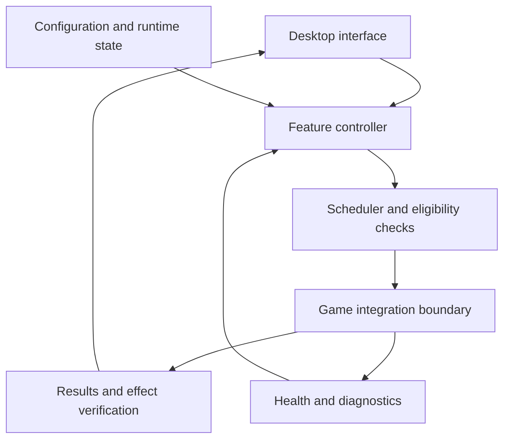

# Initial architecture assessment

## Scope and evidence

Analyzed the two user-supplied artifacts by reading ZIP entries, Windows PE
headers, printable UTF-8/ASCII and UTF-16LE strings, and the two repair scripts.
No executable or repair script was run. No game server, authentication service,
or update service was contacted. No disassembly or complete source recovery was
performed. The user reports developer permission to test and reverse-engineer;
the exact live integration interface has not been supplied.

`evidence.json` records exact sizes, SHA-256 hashes, and selected byte offsets.
Offsets address the uncompressed named file, beginning at zero. They allow
another analyst with the same upload to check the framework/component findings
without distributing the executable. Strings may describe unused code, bundled
dependencies, obsolete features, or error branches. They do not establish that
a feature works, is enabled, or has been exercised.

The GitHub repository was empty at the start of this assessment.

## Uploaded contents

| Item | Bytes | Observation |
| --- | ---: | --- |
| `LWControl.zip` | 93,278,380 | Contains exactly three files below; no source tree |
| `LWControl.exe` | 102,876,940 | Windows x64 PE application |
| `E900fix.cmd` | 2,305 | Invokes disk repair, then the application's bridge installation/restart path |
| `Repair-LastWar-E900.ps1` | 17,231 | Backup retention, temporary-file cleanup, package checks, and optional process restart |
| `lwbridge-0.3.1.exe` | 15,515,648 | Separate Windows x64 PE application |

## These are two different application stacks

| Layer | LWControl | lwbridge 0.3.1 | Confidence |
| --- | --- | --- | --- |
| Desktop host | .NET 10 / Windows Forms | Rust / Tauri 2 | High: explicit runtime, namespace, and dependency markers |
| Interface | Embedded HTML/JavaScript in WebView2 | Tauri webview with WebView2 runtime references | High for framework; visual layout unverified |
| Automation | Core feature modules, scheduler, execution, verification | Rust automation service and task settings | High for presence; algorithms unverified |
| Persistence | JSON feature runtime store; configuration-store symbols | Configuration/status files and profile state | High for presence; full schema unknown |
| Game integration | Local script-package installation and Lua heartbeat | xLua proxy components and named-pipe bridge service | High for component presence; exact runtime flow inferred |
| Operations | Diagnostics, reconnect, updates, authentication | Diagnostics, profiles, updates, authentication | High for markers; behavior unverified |

For LWControl, `.NETCoreApp,Version=v10.0`, `System.Windows.Forms`, and
`Microsoft.Web.WebView2.WinForms` identify the managed desktop stack. Its outer
PE has no CLR directory, which does **not** mean its bundled payload is not .NET.
The file also includes managed assembly names and runtime/dependency metadata.
The packaging is consistent with a bundled .NET application; the bundle manifest
has not been fully parsed.

For lwbridge, Rust source-path markers, `tauri-2.11.5`, Tauri IPC strings, and
WebView2 references identify the desktop stack. Its filename supplies the version
label used in this report; release provenance and signatures were not verified.

There is insufficient evidence to say lwbridge is a required helper for LWControl,
that one replaced the other, or that their protocols are compatible. Treat them
as separate reference applications until runtime documentation establishes a link.

## Inferred component relationships

This diagram is an architectural inference, not a recovered call graph. The
strongest LWControl evidence is the combination of `FailClosedAutomationScheduler`,
`EffectVerifier`, `JsonFeatureRuntimeStore`, execution/command namespaces, and
methods named for queuing features, polling results, and pumping automation.
The readable interface includes browser-to-host messaging and bootstrap/status
handling. Which embedded interface version is active has not been established.

For lwbridge, `src\services\automation.rs`, `src\services\bridge_store.rs`,
named-pipe lifecycle messages, and automation-status events suggest a desktop
service coordinating tasks through a separate local integration layer. This is
not evidence of a public game API. Its authentication and proxy components are
recorded only at component level; their keys, protocols, and installation
mechanisms are outside this prototype.

## Feature inventory

| Feature family | Supporting observation | What remains unknown |
| --- | --- | --- |
| Daily claims | LWControl `DailyFreeClaims` namespace/configuration symbols | Eligibility rules, reward identifiers, timing |
| Radar | LWControl `Radar` namespace/configuration symbols | Task selection and completion rules |
| Troop promotion | LWControl `TroopPromotion` namespace | Queue and resource constraints |
| Rally participation | LWControl `Rally` namespace | Team-selection rules and safeguards |
| Resource collection | lwbridge `buildingResources` and resource automation messages | Actual resource model and supported actions |
| Equipment presets | Equipment store/preset markers in both applications | Item identifiers and application order |
| Map information | Map-scan interface/state markers | Data source, supported scope, freshness |
| Profiles and recovery | lwbridge profile state; LWControl reconnect markers | Account/session isolation and supported restart flow |

These are candidates for requirements gathering, not claims of recovered working
features. The offline demo implements invented daily-claim and resource-batch
transitions solely to exercise a controller loop.

## Repair-script observations

The command wrapper runs the PowerShell repair first and only proceeds to bridge
installation when it succeeds. The PowerShell script stops relevant applications
unless configured otherwise, validates the current script package before pruning
backups, keeps a configurable number of backups, removes selected stale temporary
items, checks free disk space, and may restart the controller. Its `WhatIf` path
is intended to avoid mutation. None of these behaviors was tested on Windows.

The scripts make this a game-file modification workflow, not merely ordinary
mouse/keyboard automation. They are therefore not part of the replacement's
startup path.

One maintenance limitation is visible directly in `Test-LwlfPackage`: it parses
a declared length and CRC field but compares only file length. Its success is not
full package-integrity verification. A future developer-supported installer should
use the documented integrity algorithm and validate recovery points before
changing files. This assessment does not infer an exploitable vulnerability.

## Independent implementation delivered

`lwcontrol.py` models a small controller core with:

- Typed settings with disabled-by-default features and positive cooldowns.
- A synthetic state snapshot and a separate bridge interface.
- One action per tick, ordered by feature configuration.
- Connection and snapshot-age checks before an action.
- Request/result correlation and a post-action effect check.
- Pause on ambiguous results or adapter failures, plus explicit stop/resume.
- JSON events and a deterministic scenario runner.

The `Bridge` protocol is newly designed; it is not compatible with either
uploaded application. `MockBridge` has no network, process, input automation, or
game-file access. No original UI code, assets, scripts, or binaries are copied
into the repository.

The tests cover eligibility, cooldowns, action ordering, stale/future/disconnected
state, stop/resume, missing effects, mismatched results, transport failures,
configuration validation, and the complete example scenario. Running these tests
does not validate the original applications or any live-game behavior.

Prototype limitations: no desktop UI; no live adapter; no persisted cooldown or
request history; no asynchronous execution or enforced transport timeout; no
cross-process idempotency; no profile handling; no production logging/redaction
pipeline. Its fixed priority order and simple before/after checks are adequate
only for the deterministic mock. A live implementation needs session identity,
timeouts, action limits, durable request tracking, and stronger effect correlation.

## Next milestone

Choose one first feature, then obtain its developer-supported test interface:
how to read state, how to request the action, and how to confirm completion. A
documented SDK, supported local API, or permitted UI automation route could each
lead to a different adapter; the uploads alone do not establish one.

Useful next inputs are screenshots of the desired workflow, any available SDK or
API documentation, and redacted example state/result messages from that supported
interface. Account credentials, tokens, and license files are unnecessary for
planning the adapter.

After defining that contract, add recorded test fixtures, implement one adapter
operation in the approved test environment, verify the outcome, and then add a
desktop interface around the proven controller. A complete recreation cannot be
estimated reliably until the first live read/action/result cycle is understood.
