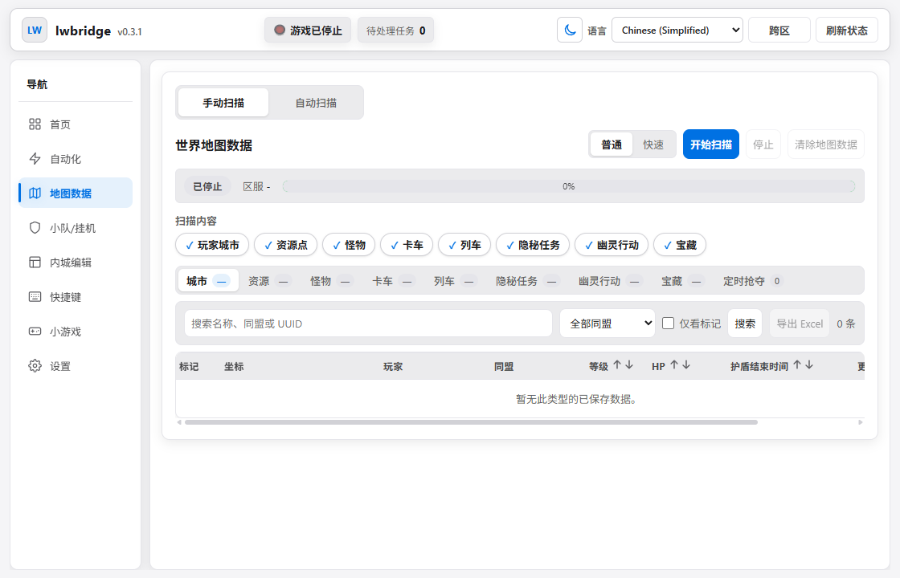

# UI verification examples

These are the 2026-09-08 post-login UI checks. The reference is the unmodified
frontend extracted from the verified LWBridge 0.3.1 executable, supplied with
synthetic local display state. It is not a direct logged-in runtime capture.

- `overview.png`, `automation.png`, `map-data.png`, `hotkeys.png`: rebuilt desktop
  WebView2 captures at 1120 × 720.
- `*-reference.png` / `*-rebuilt.png`: matched browser feature-region examples.
- `pixel-diff.json`: all 32 comparison metrics; 31 exactly identical, one with
  negligible RGB difference, all below the enforced visual thresholds.
- `report.json`: final 35 browser checks, including the 32 source comparisons and
  three groups of nested navigation checks; no JavaScript errors.
- `interactions.json`: additional focused interaction verification after fixing
  the equipment display-state shape.

See [the UI recovery report](../lwbridge-ui.md) for commands and remaining limits.

