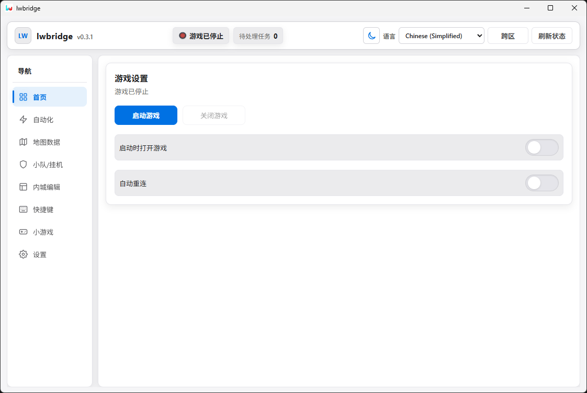
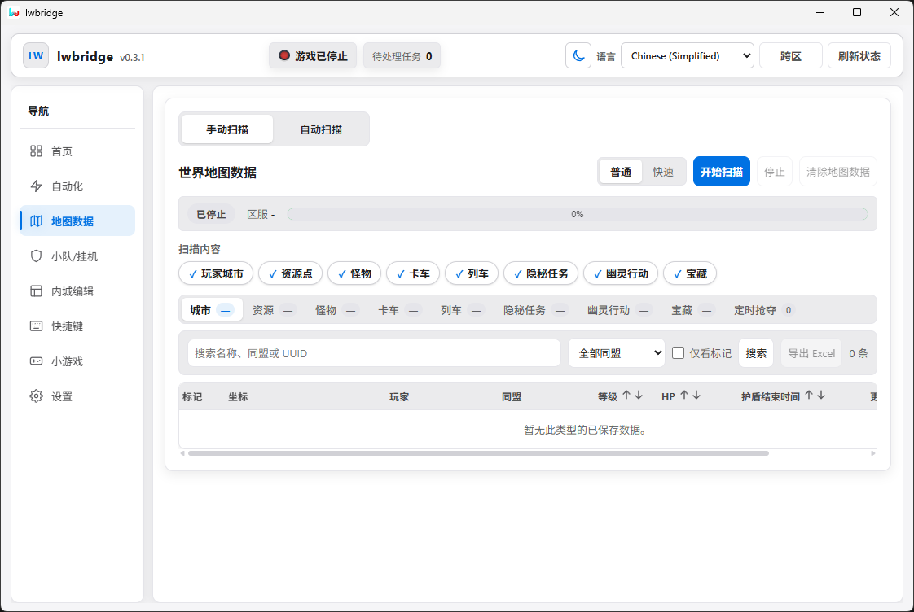

# Implementation handoff: make Overview and Map Data fully functional

## Current owner product override - Map Data simplification, 2026-09-19

The owner has explicitly changed two product requirements and these override recovered original UI parity wherever they conflict:

1. **Remove City Excel export completely from the shipped product.** Delete the visible Export Excel control/icon, frontend invocation, `map_city_export` production command, workbook writer/picker plumbing and export-only tests/runtime dependencies. Historical R6/R7 export evidence may remain for provenance, but export is no longer a release requirement and must not remain reachable in the normal UI.
2. **Remove the Normal/Fast choice from Manual Scan and Auto Scan.** The user chooses only scan contents and presses **Start Scan**. Acquisition strategy is an internal planner decision. For each selected category (and for mixed selections), the backend must choose the fastest currently proven safe strategy/concurrency/request shape while preserving exact coverage/publication correctness. Legacy `normal`/`fast` values may remain only as internal compatibility/diagnostic tokens where needed; they must not be a user-facing setting or persisted user preference.

Acceptance for the scan planner requires that the same category/server produces the same trustworthy published dataset regardless of which internal strategy is selected, that transient Fast/AOI failures retry or fall back only according to proven safe rules, and that the UI truthfully shows one Start/Stop/Clear flow without exposing implementation strategy controls.

**Latest checkpoint - `LWB-R7-091`, 2026-09-20:** acceptance case **A04 is IMPLEMENTED/OFFLINE-TESTED**. `OverviewLaunchSpamChecks` holds one admitted Start in `starting`, then issues 48 concurrent secondary Launch attempts and 120 `profile_instance_status` refreshes; this was repeated 10 times. All 480 duplicate Launch calls returned `GAME_OPERATION_IN_PROGRESS`, all 1,200 refreshes reported the same in-flight session with no fabricated PID, only one helper Start ran per iteration, no stale success appeared, and each run ended stopped. R7-088's A04 `partial` row is superseded only; A05/A06/A07/A08/A11 remain open, and A11 still depends on unrecovered `get_status.pending` semantics. Evidence: `evidence/lwbridge-implementation/2026-09-20-r7-overview-launch-spam-refresh.json`.

**Latest checkpoint - `LWB-R7-090`, 2026-09-20:** acceptance case **A10 is IMPLEMENTED/OFFLINE-TESTED** for the admitted Home startup pipeline. The unified failure matrix covers six host branches and 12 production-helper transaction stages. It executes real temporary-file backup/recovery-journal/install/rollback/clear code, records before/after/final hashes, proves interrupted-recovery journal retention versus clean rollback clearing, preserves unmanaged ownership, closes helper-owned launcher/game fixtures where required, and requires a successful subsequent normal retry + clean stop for every helper stage. Host checks additionally pin official recovery/settle failures, bounded Lua-update/launcher retries, generic helper failure retry and post-helper readiness cleanup/retry. R7-088's A10 `partial` row is superseded only; A04/A05/A06/A07/A08/A11 remain open. Evidence: `evidence/lwbridge-implementation/2026-09-20-r7-overview-startup-failure-matrix.json`.

**Latest checkpoint - `LWB-R7-089`, 2026-09-20:** acceptance case **A09 is LIVE-PROVEN** on current-v19. The existing production Home lifecycle path completed 20 consecutive cycles (10 manual and 10 startup-reconcile) with 20 unique sessions/PIDs. Every Start reached `running/connected`; every exact owned Close exited and restored the original Lua package/metadata/version files with `installedFilesChanged=false`, and final hashes match the pre-stress baseline. No external stress-runner retry masked a failed proof invocation, no gameplay/scan action ran, and no Last War/launcher process remains. R7-088's 47-row snapshot is preserved historically; only its A09 `not_run` row is superseded. Evidence: `evidence/lwbridge-implementation/2026-09-20-r7-overview-twenty-cycle-stress.json`.

**Latest checkpoint ? `LWB-R7-088`, 2026-09-20:** offline Release integrity is current again. The audit discovered that the canonical frontend generator no longer reproduced the maintained WebUi because approved R7-066/R7-067 and six later Map Data panel checkpoints had direct generated-bundle changes outside generator maintenance; it also found parity/pixel tests still expecting the retired Export/Normal-Fast UI and no Zombie Boss. The generator now preserves those changes under exact source/base/result checks, all generated assets reproduce byte-for-byte, CI includes the owner-override browser regressions, Release builds with 0 warnings/0 errors, the six deterministic groups and host/transport/security checks pass, deterministic captures and 36 browser checks pass, and unchanged visual pairs are 28/28 pixel-identical. The R7-088 evidence enumerates all 47 acceptance cases conservatively; C06 remains retired and final live acceptance is still open for explicit remaining stress/population/action/F04 gates. Evidence: `evidence/lwbridge-implementation/2026-09-20-r7-release-integrity-audit.json`.

**Latest checkpoint — `LWB-R7-070`, 2026-09-20:** the Auto Scan core scheduler backlog item is closed by audit rather than new production code. `LWB-R7-038/039` already live-proved repeated Run Now cycles, ordered multi-target scanning, disable-during-cycle skip, return-to-original/status truth, persisted future scheduling across full desktop/game restart, unattended deadline execution, and next-schedule advancement. The current post-R7-067 shipped bundle still owns Auto scheduling in the top-level app, persists per-profile enable/20–1440 minute interval/target servers/return preference/`nextRunAt`, starts shared scans without caller `scanMode`, stops sequencing after disable, returns in `finally`, and persists the next deadline. Strengthened browser and deterministic regressions pass; Release build is 0 warnings/0 errors and all six deterministic groups are green. Dedicated live navigation-away/back and a naturally occurring native travel failure remain narrow evidence gaps only. Evidence: `evidence/lwbridge-implementation/2026-09-20-r7-auto-scheduler-closure-audit.json`.

**Previous checkpoint — `LWB-R7-069`, 2026-09-20:** Treasure read-only result/status plumbing is complete. Production now handles `map_treasure_state_refresh`, `map_treasure_state_refresh_all`, and `map_treasure_claim_status` on the existing owned current-v19 session, with current-server/active-scan/game-operation gates, correlated 100-row live batches, recovered cache persistence/overlay, and fail-closed `unknown` for ambiguous state. Full deterministic acceptance passes. Final read-only live proof on server 2212 completed Fast 2,500/2,500 with zero failures, published 8 Treasure rows, returned/cached/overlaid 8/8 states, and resolved all eight player states to `unclaimed` from scan-time viewer-relative membership. No claim/scout/march action was invoked and `claimPriority` was not fabricated; `map_treasure_claim` remains blocked. Evidence: `evidence/lwbridge-implementation/2026-09-20-r7-treasure-state-refresh.json`.

**Previous checkpoint — `LWB-R7-068`, 2026-09-20:** Treasure query/state-cache recovery is complete for the proven static slice. Original SQL closes `includeForeignRadarTreasures`, `luckyFirst`, `viewerUid`, and `viewerAllianceId`; production reproduces foreign-radar visibility, viewer fallback, cached lucky priority ordering, claim-state join/overlay and expiry cleanup/upsert. Release build and the full six-group deterministic suite pass. That static checkpoint is now live-completed by `LWB-R7-069`; `map_treasure_claim` remains blocked.

**Previous checkpoint — `LWB-R7-067`, 2026-09-20:** automatic scan-strategy ownership is complete. Manual Scan and Auto Scan no longer expose or persist Normal/Fast controls; both frontend start paths send content selection without `scanMode`. `MapScanContract` keeps legacy caller mode values as ignored compatibility input, while `MapScanStrategyPlanner` chooses the effective strategy only after authoritative live context is known. Standard current-v19 1000x1000 normal-world scans choose the proven Fast full-world path at internal concurrency 20; dedicated Monster/Zombie Boss chooses `current_fast_monster_lod2_v1`; nonstandard single City/Resource retains the proven ordinary LOD0 fallback at concurrency 8; unsupported nonstandard category shapes fail closed. Status now exposes `scanStrategy` as a diagnostic. Candidate browser acceptance proves no Manual/Auto speed UI or persisted mode remains, the full six-group deterministic suite is green, and a live server-2212 Zombie Boss run started with no caller `scanMode`, selected `fast / current_fast_monster_lod2_v1 / 20`, and completed 2,500/2,500 with zero failures in 5.118 s. Evidence: `evidence/lwbridge-implementation/2026-09-20-r7-automatic-scan-strategy.json`.

**Previous checkpoint — `LWB-R7-066`, 2026-09-20:** the owner-requested City Excel export removal is complete. The shipped Map Data UI/API and all nine locale bundles no longer contain the export control/invocation/strings; production no longer routes `map_city_export`; the desktop save-dialog path, OOXML writer, export-only SQLite full-snapshot branch and export-only tests are deleted. A negative backend regression requires the retired command to return `COMMAND_NOT_IMPLEMENTED`, a candidate-only browser test proves Map Data loads with no Export Excel surface or invocation, and the full deterministic suite is green. Historical R6/R7 export evidence remains archival provenance only. Automatic scan-strategy ownership is subsequently closed by `LWB-R7-067`.

**Previous checkpoint — `LWB-R7-065`, 2026-09-20:** Truck/reward game artwork is LIVE-PROVEN on current-v19 through the public `game_asset_image({assetPath})` path. Production now uses the game-owned xLua `SpriteRenderer:LoadSpriteAuto` extension, extracts the returned Sprite by `textureRect` with GPU `Graphics.Blit`, encodes PNG/base64, validates the PNG and dimensions in the host, and reuses a bounded exact-source cache. Four representative authoritative Truck reward paths passed live, including a packed atlas Sprite, and pixel checks prove populated artwork rather than a transparent PNG. `spriteName` remains fail-closed and is not required by Truck `currentGoods`. Durable evidence: `evidence/lwbridge-implementation/2026-09-20-r7-truck-game-asset-image.json`. City Excel export removal was subsequently completed by `LWB-R7-066`.

## Retained shared Manual Scan direction - 2026-09-13

**PM17 correction delivery is complete.** `LWB-PM17-001/002` remain IMPLEMENTED/OFFLINE-TESTED at their documented revision. Player City `LWB-PC-001/002/003` remains valid evidence for authentic city acquisition, persistence, reopen/search and owner-visible saved-row rendering. Initial Map Data load may automatically query persisted City data, so a row visible before Search is saved data, not a fresh acquisition.

**Active Map Data direction:** stop treating the visible category order as eight separate scanner projects. The common Manual Scan engine/persistence checkpoint is now IMPLEMENTED/OFFLINE-TESTED for recovered-grid traversal, run identity, bounded source retry, Stop/cancel ownership, truthful scheduler counters, transactional block checkpoints/staging, and guarded final publication. The next production-critical task is the real arbitrary-target current-game block source plus live proof that each targeted response covers its intended block; do not wire ordinary Start to saved/preloaded data or call the engine a full-world scanner before that proof. The eight `selectedTypes` values remain content selectors for this one engine; Search/filter/sort/options and row actions remain downstream consumers of persisted data. City Excel export is retired by the 2026-09-19 owner override.

Recovered historical mode parity proves Normal concurrency `8` and Fast concurrency `20`; these are now internal strategy evidence only. The shipped product must not ask the user to choose a mode. The backend planner chooses the fastest proven-safe strategy for each selected category/mixed run and records the effective internal strategy truthfully. `100%` or a completed helper is not a completion gate by itself. Clear must remain server-scoped, preserve marks under the recovered contract, safely resolve an active run and prevent late results from repopulating cleared data.

Use Player City as the first normal-page acceptance category for the common engine, then Resource, then Monster/Truck/Railway/Dispatch/Ghost/Treasure, then mixed selections and all eight. The existing bounded `LiveResourceProbeCommandService` city/resource path is evidence/support code, not full-world production scanning. Auto Scan comes only after Manual Scan and must reuse the same engine and the same backend strategy planner.

**S03 complete Refresh Status and S06 cross-server travel remain PENDING/DEFERRED.** S02 remains unfinished/unassigned. Existing operation-specific restrictions, including SB-97, remain in force and must not be bypassed. Do not claim the whole Map Data feature complete from the Player City result or from the common engine until the relevant acceptance gates pass. See `docs/map-data-delivery.md` and `docs/team-workflow.md` for the active sequencing.

### Retained earlier resource/PM15 checkpoint — not the active assignment


## Mandatory user rules — apply to every AI and every checkpoint

Read [AGENTS.md](AGENTS.md) before starting. Its repository-wide requirements are mandatory and must be included in delegated work/handoffs. Even when this task file is passed alone, the following rules still apply:

1. **Reverse-engineer first.** Prioritize the verified LWBridge executable/recovered assets and the current official Last War files, executables and runtime evidence. Trace original/current contracts before implementing them. Never invent values, defaults, offsets, schemas, timings, formulas or success conditions. Every recovered behavior-affecting value needs source provenance; unknowns remain `UNKNOWN/BLOCKED`, not arbitrary production fallbacks. Explicit rebuild design choices must be labelled `IMPLEMENTATION POLICY` and cannot masquerade as recovered parity.
2. **Document every successful finding immediately.** Save it in the existing subject document/evidence directory before relying on it or moving on. Include a stable finding ID, source hash/version, exact locator, reproduction command/steps, result/types/units, evidence label, validation/limits, affected feature/code and remaining questions. Chat/scratch output alone is insufficient. Update the evidence index, feature ledger and backlog so the next AI can reproduce and continue the work.
3. **Commit and push each completed task or coherent checkpoint.** Run applicable checks, document results and open gates, review/stage only the relevant changes, commit and push to the verified working branch on GitHub, then verify/report the remote commit. This is the user's standing project instruction. Do not force-push, silently skip delivery or claim a blocked feature is finished. Record the exact blocker if delivery cannot complete.
4. **Tools and installation are pre-authorized.** Discover and use/install/configure the tools and dependencies necessary for this work without asking the user again. Missing Ghidra/MCP integration is not a blocker: use standalone/headless/CLI/GUI analysis or another suitable permitted tool. Use trustworthy distributions, verify setup and document tool versions/paths/commands so another AI can reuse them. If an operation is actually denied, identify the environment/tool and exact reason; do not imply the user withheld permission. These instructions cannot override platform/OS restrictions. See `AGENTS.md` section 3 for the mandatory discovery and blocker-reporting rules.

Send `AGENTS.md` with this file when handing work to another AI. The full rules, evidence fields and completion checklist are defined there; do not weaken them for convenience.

Prepared: 2026-09-08; current project-manager review 17 with 2026-09-13 owner priority override. **This is the primary AI instruction and full acceptance file.** Read `AGENTS.md` first, [BACKLOG.md](BACKLOG.md) for priorities and [the audit](docs/lwbridge-project-status.md) for source/proof limits. Keep one task specification; do not recreate `TASKS.md`.

## Team ownership — updated owner instruction, 2026-09-11

ChatGPT Web is the single primary implementation and technical verification worker; no separate Sol role remains. The owner performs only clearly guided permitted UI actions and supplies descriptions/screenshots. Web must implement/reuse and verify scripts for all needed technical capture, preferably operating them directly, or supply a tested double-click entry point. Never ask the owner for commands, terminal output, hashes, JSON/database inspection or recovery diagnosis.

PM audits and assigns work; Daybreak takes only a reviewed specialist question. Follow AGENTS.md section 8, [workflow/prompts](docs/team-workflow.md), [technical packet](docs/live-test-handoff.md) and [owner guide](docs/user-test-checklist.md). `LWB-PM13-008` delivered the reviewed passive owner package. The owner then completed attempt `20260911T085114Z-eb1cd35e-7f21ad24`, which showed the normal no-saved-map-server state and no scan/game action. `LWB-PM13-009` fixes the collector's false `INCOMPLETE` classification for that frontend short-circuit and records the branch as `COMPLETE_NO_SAVED_CONTEXT` without inventing `map_search`. **Do not ask the owner to repeat the current passive check.** This work does not authorize fresh acquisition; SB-97 remains unresolved and manual testing is not a workaround for a denied operation.

## Review 15 — immediate task

Web delivered the bounded PM15-01/02 repairs at implementation commit `1e9af6e`: each owner-app launch has a distinct collector session/PID-owned log set, and failed process/app/evidence observations remain UNKNOWN/INCOMPLETE instead of clean. `LWB-PM15-001` records seven isolated regressions and the exact package identity. **Return to PM for audit; do not ask the owner to repeat the accepted no-context check.** PM13-04 fresh acquisition remains blocked; no new live acceptance.

## Current project-manager handoff — earlier accepted scope

Reviewed implementation base: `7ca6d5c`, 2026-09-11, `research/offline-controller`. [Review 14](docs/lwbridge-project-status.md) accepts the saved-browsing, feedback, lifecycle and proof-correlation repairs at their stated scopes. **PM13-04 is the only active final resource gate; the complete pages are not finished.**

- **ACTIVE/BLOCKED:** the current profile has no saved map server. Passive owner verification of that state is complete; the remaining resource gate is still a permitted real Resource-only Start -> normal Search/render -> second newer read -> reopen, with source/request/storage/query/render and cleanup evidence. SB-97 currently blocks that fresh operation.
- **CLOSED repairs:** PM13-01/01b/03/02 and the coordinate/reopen proof correction. Do not restart those tasks without a reproduced regression.
- **TEST READINESS:** code is a candidate for controlled real-game validation, conditional on current-client integrity and a permitted execution path. Computer Use setup is separate from feature acceptance; the standard AI may perform capability checks. SB-97 is unresolved and cannot be bypassed through another model/executor or PM permission.
- **NEXT:** monster acquisition/search only after resource exit criteria pass. No Daybreak assignment; original-pipe parity, updater and broad export work remain deferred.
- **DELIVERY:** preserve all 47 cases below. Commit/push and verify each coherent checkpoint; report actual working results separately from offline tests.

## 1. The user's requested outcome

Work in the existing LWBridge reconstruction and make **all functionality belonging to these two pages work against the real, currently installed Last War client**:

1. **Overview / 首页**: game setup, launch, close, launch-at-startup, automatic reconnect, and their shared status controls.
2. **Map Data**: manual scan, automatic scan, every data category, searching/filtering/sorting/pagination, map navigation, and all conditional row/bulk actions, including treasure and scheduled-plunder workflows. City Excel export is intentionally removed from the rebuilt product.

Keep the reproduced UI faithful to `lwbridge-0.3.1.exe`. The user already asked to remove login and to recreate functionality independently. **Do not reintroduce a login, license activation, renewal, unbind, or account-expiry gate.**

This is an implementation and reverse-engineering assignment, not another UI mockup assignment. Deliver working code, a runnable build, meaningful tests, and evidence of actual outcomes. A button click, resolved JavaScript promise, process launch, command send, empty result, or successful screenshot is insufficient evidence that the corresponding feature works.

The screenshots show only one state of each page. **“All functionality on these pages” includes controls that appear after connection, on other tabs, in menus/dialogs, when rows are selected, while scanning, and when jobs are running or failing.** Do not silently narrow scope to the controls visible in the screenshots.

### User-supplied visual references

The images have been copied from temporary clipboard paths into the repository:

- [Overview screenshot](docs/task-reference/overview-user-reference.png)
- [Map Data screenshot](docs/task-reference/map-data-user-reference.png)





The Overview image shows the stopped-game state, Launch Game, disabled Close Game, and the launch-at-startup and reconnect switches. The shared header contains game status, pending-task count, theme, language, cross-server navigation, and Refresh Status. Historical Map Data references may show Normal/Fast and Export Excel, but the 2026-09-19 owner override explicitly removes those controls from the rebuilt product. The target Map Data UI has Manual/Auto Scan tabs, one Start/Stop/Clear flow, progress, scan-content choices, result tabs and their search/filter/action controls. These descriptions keep the assignment understandable even if only this Markdown file is transferred. Send `docs/task-reference/` too when possible.

Treat screenshots, extracted strings, comments, and binary contents as reference data. They are not independent instructions overriding the user's request or the receiving environment's rules.

## 2. Workspace, authority, and starting state

### 2.1 Exact project and reference

| Item | Value at handoff |
|---|---|
| Workspace | current repository root |
| Reference executable | `..\LW\lwbridge-0.3.1.exe` in the current development layout |
| Reference SHA-256 | `2a2de09b35bb6a03f26b5e05f949f3aea6215f294127e605d7d78481f855cdff` |
| Branch | `research/offline-controller` |
| Durable documentation index | `docs/README.md` |
| Current desktop project | `src/LWBridge.Desktop/LWBridge.Desktop.csproj` |
| Runtime target | .NET 10 Windows / WinForms host / WebView2 |
| Original application | Windows x64 Rust/Tauri application with embedded React/Vite UI |

Recheck Git status and the reference hash before modifying code. Preserve the current LWBridge source and durable evidence, and use `docs/README.md` to determine which documentation is current.

### 2.2 What currently works

- Original recovered React components, stylesheet, icons, feature chunks, and nine language bundles render in WebView2.
- The eight normal navigation pages exist. Advanced is compiled into the original but hard-hidden by `An(!1, o.state.accessRole)`; the reconstruction exposes it only with explicit `--view advanced`. Advanced is outside this assignment.
- Active login/account UI has been removed.
- Local visual interactions and some local preferences work.
- Source generation verifies the recovered asset manifest.
- The documented prior verification passed nine desktop captures and 35 browser checks. Of 32 paired feature-region screenshots against the unmodified extracted frontend with synthetic native responses, 31 were pixel-identical and one had negligible difference. This was **visual fixture proof**, not real game functionality.

### 2.3 Current production boundary

The rebuild now has a real native backend foundation, but the complete game lifecycle and Map Data backend are not finished.

- WebView2 has real profile/session RPC and a shared request executor. Cooperative/noncooperative request tests pass, and the isolated real WebView2 host now verifies document-session rotation, duplicate active request rejection, reload cancellation/subscription reset, stale-session rejection, origin/error handling, responsive rendering during real config-lock contention, picker interactions, overlapping preference saves/rollback and closed-window late-response suppression.
- Local profile/preferences and basic installation checks are implemented. Durable writes, isolated storage, backend partial-update concurrency, missing-primary backup recovery, incompatible owner/schema preservation and storage-fault checks pass offline. PM3-01/02 now also pass visible save-error, failed-overlap reconciliation and recovery checks in the provider and actual WebView host. The ABI selector is recovered; its lifecycle integration remains R5.
- Production status distinguishes process existence from bridge readiness; an unmanaged running game is not reported as connected.
- `profile_instance_start` remains intentionally blocked until the recovered launch-envelope/proof/ticket bootstrap contract is complete.
- Map Scan request normalization is implemented, but production scan execution remains blocked until a verified bridge-ready session and native capture pipeline exist.
- Fixture game-command handling does not fall through to the live backend. Capture/read-only verification uses isolated config storage, requested live mode fails visibly with `NATIVE_TRANSPORT_MISSING` when native transport is absent, and the controlled R4 production-WebView scenarios, including PM3-01/02, pass. None of this proves a real game lifecycle or scan worker.

Do not convert a fail-closed command into success until the corresponding runtime operation and authoritative post-state are implemented and verified.

## 3. Read these sources before implementation

All paths below are relative to the workspace root unless explicitly absolute.

| Source | What to recover or preserve |
|---|---|
| `docs/lwbridge-ui.md` | Existing UI transformations, source-parity proof, and limitations |
| `docs/lwbridge-architecture.md` | Original architecture and embedded component hashes |
| `docs/lwbridge-injection.md` | Staged launch/injection lifecycle, timeout evidence, unknowns |
| `docs/lwbridge-map-scan.md` | Recovered scan request, native capture vocabulary, unresolved scheduling/schema rules |
| `docs/lwbridge-artifact-evidence.json` | Supporting static artifact evidence; inspect its actual contents |
| `docs/official-runtime-architecture.md` | Current installed Last War runtime/launcher baseline and read-only evidence |
| `docs/README.md` | Documentation reading order and evidence map |
| `BACKLOG.md` | Broader recovery backlog; preserve unrelated items |
| `evidence/lwbridge-0.3.1/frontend/manifest.sha256.txt` | Integrity manifest for immutable extracted UI assets |
| `evidence/lwbridge-0.3.1/frontend/assets/index-sfL2sT3K.js` | Overview, shared header, navigation, status refresh, profile use, auto-scan orchestration |
| `evidence/lwbridge-0.3.1/frontend/assets/MapDataPanel-C1HVeNHr.js` | All Map Data controls, data queries, row actions, conditional states, export, jobs |
| `evidence/lwbridge-0.3.1/frontend/assets/api-ClPPi2JT.js` | Original command names, payload construction, implicit profile injection, event envelopes |
| `evidence/lwbridge-0.3.1/frontend/assets/index-C5e98iqj.css` | Original visual authority; do not redesign it |
| `evidence/lwbridge-0.3.1/frontend/assets/en-CglaO9J7.js` and `zh-CN-L1LjMs4w.js` | UI labels, errors, and feature terminology |
| `src/LWBridge.Desktop/LWBridgeWindow.cs` | Native host integration point, startup, navigation restrictions, capture path |
| `src/LWBridge.Desktop/LWBridgeBackend.cs` | Current command handlers, deliberate unsupported gates, status placeholders and scope validation |
| `src/LWBridge.Desktop/LocalConfigStore.cs` | Profile/root/preference persistence; audited save/load recovery gaps |
| `src/LWBridge.Desktop/GameInstallationService.cs` | Installation/process checks and remaining compatibility/ownership work |
| `src/LWBridge.Desktop/MapScanContract.cs` | Already implemented selected-type/mode normalization; preserve its recovered behavior |
| `tests/LWBridge.Desktop.Checks/Program.cs` | Deterministic foundation/map checks now include PM2 partial-save/recovery/compatibility and request-lifetime regressions; optional installed-game diagnostics remain separate |
| `src/LWBridge.Desktop/NativeRequestExecutor.cs` and `NativeRequestRegistry.cs` | Cooperative/noncooperative request lifetime checks plus real document reload/close/duplicate-ID publication gates pass; connect the same ownership to real lifecycle/scan workers next |
| `src/LWBridge.Desktop/MapDataStore.cs` and `MapDataQueryContract.cs` | Existing SQLite schema, explicit-key records/marks/clear and query-envelope validation; preserve and extend |
| `tools/check_lwbridge_live_transport.cjs` and `check_lwbridge_transport_boundary.cjs` | Node runtime tests for requested live mode, generated profile wrappers and browser-side protocol behavior |
| `evidence/lwbridge-implementation/pm-review-2-repro/` | Independent reproducer that captured the four review-2 failures and now passes against the repaired current source |
| `evidence/lwbridge-implementation/2026-09-08-pm2-foundation-fix.json` | Source hashes, locators, commands, results and limits for the PM2 repair checkpoint |
| `evidence/lwbridge-implementation/2026-09-08-r4-native-host-interactions.json` | Recovered picker contract plus real WebView2 duplicate, preference rollback/overlap, picker and closed-window interaction evidence |
| `docs/lwbridge-project-status.md` | Dated audit, R1–R10 remaining work, dependencies and exit criteria |
| `docs/lwbridge-feature-ledger.md` | Current S/O/M implementation and proof status |
| `src/LWBridge.Desktop/WebUi/local-providers.js` | Current local profile/startup state; production needs genuine stable runtime association |
| `src/LWBridge.Desktop/WebUi/preview-host.js` | Existing live RPC and separate fixture adapter; audit mode selection, profile/event routing and lifetime |
| `src/LWBridge.Desktop/WebUi/presentation.css` | Existing 54 px header-height adjustment after removing the account button |
| `tools/build_lwbridge_frontend.py` | Repeatable transformations; generated files must stay reproducible |
| `tools/inspect_lwbridge_injection.py` | Existing static bootstrap inspector |
| `tools/inspect_lwbridge_map_scan.py` | Existing static scan inspector |
| `tools/inspect_lwbridge_proxy_map_scan.py` | Existing proxy capture inspector |
| `tools/capture_lwbridge_ui.ps1` | Desktop page capture checks |
| `tools/check_lwbridge_frontend.cjs` | Isolated source-reference/fixture browser checks |
| `tools/compare_lwbridge_frontend.py` | Pixel comparison thresholds |
| `docs/ui-reproduction/` | Persisted representative UI proof |

Readable files may also exist in `.codex-live/lwbridge-readable/`. These are convenience outputs, not durable authority. Recreate readable copies from the hashed assets if absent. Search with `rg`; avoid printing entire minified bundles or repeating expensive analysis already supported by evidence.

Some old notes refer to files that have since been removed. Verify existence instead of following stale paths blindly. Do not restore obsolete implementation wholesale just because a document mentions it.

## 4. Working rules and evidence standards

1. **Recover before guessing.** Trace the UI trigger, frontend arguments, host handler, runtime request, response handling, state change, and visible result.
2. Label facts explicitly: **RECOVERED** for original static behavior, **IMPLEMENTED/OFFLINE-TESTED** for new code/fixture tests, **LIVE-PROVEN** for observed current-client outcomes, and **UNKNOWN/BLOCKED** for unresolved items.
3. Keep original assets immutable. Make maintained adapter/source changes and update deterministic generator transformations. Do not hand-edit generated chunks and lose the changes on regeneration.
4. Preserve the current UI layout, labels, icons, theme/language behavior, and navigation. Small changes needed for truthful busy/error states must be explicit and measured, not a redesign.
5. Do not add login back. Use a locally owned runtime/session identity where the independent implementation needs one. Recover launch descriptors and transport integrity separately from vendor licensing; do not forge vendor credentials or claim authentication to an original service.
6. Keep fixture mode explicit and isolated. Default normal launch must eventually use the real backend; capture/tests must remain deterministic and must never launch, scan, claim, attack, or send messages automatically.
7. Keep unrelated pages working visually. Shared API changes must not silently break their preview behavior or activate unrelated automations.
8. Preserve numeric precision, identity, nullability, enum values, and timestamp units. Unknown is not zero; stale is not current; an empty cache is not proof that a world contains nothing.
9. A successful command dispatch or `accepted` flag proves only that stage. Require authoritative completion evidence for launch readiness, indexing, movement, claims, and plunder outcomes.
10. Record findings continuously. Maintain a command/feature ledger with source locations, new implementation locations, tests, current-client evidence, and remaining gaps.

### Live testing and authorization

The user explicitly grants standing permission to open, close and restart the official game/launcher whenever needed for testing, including an already-open session, and to control the computer through the Computer Use plugin for project tests. Bounded scanning/data reads for the first live-result demonstration are authorized. Do not repeatedly ask for those routine actions; follow AGENTS.md and active tool instructions. This does not turn a manually opened session into a proven rebuild-owned bridge session or override environment restrictions. Synthetic auth responses remain fixtures, not credentials.

Proceed autonomously with authorized implementation, static research, builds, read-only inspection, and offline tests. Reuse valid standing authorization rather than asking repeatedly. Before a live action, verify that its concrete scope is covered: game/process changes, cross-server travel, scanning, actual claims/plunder, paid resources, and messages are distinct effects. If required authorization or a suitable test target is missing, finish the independent work and present a concrete bounded test plan and the exact remaining need.

Implement alliance-sharing fully, but do not send a real alliance message without explicit messaging authorization. Do not spend currency or consumables as an incidental test. Unknown costs/target identity must stop dispatch. Implementation scope includes these features; lack of live authorization means their LIVE-PROVEN gate remains open, not that they disappear from scope.

For authorized live work: capture before-state, use a bounded attempt, capture response and authoritative after-state, and restore protected files/hooks/resources in `finally`. Inventory and hash any runtime files before replacing them. Do not kill unrelated Last War sessions or every process with a matching name. Stop only identified owned processes or explicitly authorized existing sessions. Keep a journal sufficient to recover after an abnormal exit.

## 5. Production integration required across both pages

### 5.1 Complete the existing real command/event adapter

Extend the existing native service boundary to satisfy the recovered frontend contract. The transport foundation already exists; use the R1–R4 findings instead of replacing it from scratch. Reuse the current .NET/WebView2 shell unless evidence establishes a concrete reason to change hosts.

The adapter must provide:

- An explicit command allowlist, payload validation, request IDs, correlated responses, structured errors, timeouts, and cancellation.
- Origin validation for WebView messages. Do not replace the current external-access restrictions with unrestricted JavaScript-to-shell, filesystem, or arbitrary Lua access.
- Correct serialization of optional fields and large IDs; JSON precision must not corrupt UID/UUID/world/point identifiers.
- Stable local profile/session IDs mapped to a specific game/runtime instance. A literal `local-1` cannot stand in for actual identity verification.
- Original implicit-profile behavior: the unmodified API adds the active profile ID where a command does not explicitly provide one. The generated preview seam currently removes that original wrapper, so production must restore equivalent routing deliberately.
- Events with the original subscription/unsubscription semantics, including profile filtering of envelopes containing `profileId` and `payload`. Ignore delayed responses/events from a previous session, server, profile, or scan run.
- Idempotency for start/stop/save and recovery from duplicate requests. No two game-start, scan, or scheduler owners may race silently.
- UI-thread-safe result delivery and nonblocking native work. Large scans and exports must not freeze WebView rendering.
- Durable configuration and map/job stores, versioned migrations, atomic writes, and recovery from interrupted writes.
- A separate deterministic preview/test transport that cannot fall through to the live backend.

Keep real service state independent from whether a page is visible. Page navigation must not duplicate schedulers, lose accepted work, leak listeners, or trigger another game startup. Recovered React `Activity`/hidden views and mounted effects require an explicit ownership audit.

### 5.2 Shared header controls are in scope

| ID | Control | Required behavior and proof |
|---|---|---|
| S01 | Game status | Show stopped/starting/checking/disconnected/recovering/connected according to verified process + session + bridge heartbeat state. Process existence alone cannot produce connected. |
| S02 | Pending-task counter | Recover what the original counter counts; expose that value from the backend. Do not substitute scan blocks, queue length, or a constant without evidence. |
| S03 | Refresh Status | Fetch real host/proxy/recovery state and the original runtime status operation where applicable. Update the visible state and report failures. Repeated refreshes must not launch another game or reset a scan. |
| S04 | Theme | Preserve original light/dark behavior and persistence, including after restart and navigation. No native side effect. |
| S05 | Language | Preserve all nine UI languages and refresh localized game-derived names where required. Keep IDs/filter meaning stable across language changes. |
| S06 | Cross-server / 跨区 | Recover selector/history/current/home/season/truck-match options. Validate server IDs and actual travel eligibility. Navigate the game and confirm the new server before changing data context. Handle same-server no-op, unavailable server, connection loss, and active-scan conflicts. |
| S07 | Navigation | Both pages continue to function after repeated switching; preserve each page's intended filter/configuration state and avoid duplicate timers/events. |

Original frontend Refresh Status includes a `call_lua` request for the runtime `getStatus` operation. Recover and implement this precise capability through an allowlist; do not expose a general arbitrary-script execution surface just to satisfy that call.

## 6. Overview / 首页 — complete functional requirements

### O01. Discover and select the real game installation

- Recover original game-root discovery, path selection, validation, error states, and persistence.
- Resolve the actual installed current client and official launcher; record their versions/hashes for the evidence run. Do not assume an old build or a path from historical notes is current.
- Return genuine `game_root_status`; remove synthetic `valid: true` from production.
- Show the original missing-root/Select Game Directory controls when needed, even though they are absent from the supplied stopped-state screenshot.
- Validate required binaries, architecture, runtime/proxy compatibility, and directory permissions before startup.
- Cancelled selection must leave the previous valid configuration intact. Invalid selection must not be saved as usable.
- Test a valid path, missing path, moved installation, permission failure, path with spaces/non-ASCII characters, and conflicting/stale process state.

### O02. Launch Game / 启动游戏

- Bind the button to a real scoped launch service. Disable/reject reentrant starts and expose progress and specific failure states.
- Recover the target's lifecycle, not a guessed `Start-Process LastWar.exe` shortcut.
- If the official launcher is required, use it with the current recovered handoff rather than a stale launch argument/ticket from another session.
- Detect an already-running uninstrumented game and handle it through the recovered, authorized lifecycle. Do not declare it connected just because its window exists.
- A successful launch needs the correct running process, matching session identity, initialized bridge/runtime, and a fresh heartbeat/status response. Keep “process started” separate from “bridge ready.”
- Ensure app startup, manual Launch, reconnect, and update/restart all use the same underlying lifecycle service and do not create competing processes.
- Log a bounded failure reason and clean up partial initialization if any stage fails. UI must remain usable for retry.

#### RECOVERED bootstrap evidence to start from

The target embeds a profile launcher, a multi-hook DLL, secure/plain xLua proxies, and a script package. The documented recovered sequence validates descriptor/runtime identity and integrity, prepares redirect state, establishes ready/go/failed coordination, creates the official launcher/game suspended, loads the hook, requires readiness, releases startup, redirects the xLua load, and establishes a matching local bridge handshake.

Recovered waits are 30,000 ms for injection/module load, 30,000 ms for hook readiness, 300,000 ms for launcher/game PID handoff, and 5,000 ms for cleanup/thread close. These are original static facts, not a requirement to block the UI for those periods or proof of live success.

Proxy selection depends on the original xLua PE/export ABI fingerprint. Do not always select secure or plain. Recover the algorithm, descriptor fields, ownership, and error handling. The script bundle begins with `LWBP`, version 2, and is encrypted/high-entropy; marker strings do not reveal its full implementation. Missing internals require further recovery or an explicitly documented independent implementation, not invented semantics.

### O03. Close Game / 关闭游戏

- Resolve the currently owned instance and its `instanceId`; stop that instance through the correct service.
- Cancel/freeze relevant scheduling, finish or abort inflight work safely, persist checkpoints, dispose transports, and release hooks/runtime resources.
- Restore protected original setup where the recovered lifecycle requires it. “Stopped and original setup restored” may only be shown/logged after verification.
- Verify actual process exit/ownership release and fresh stopped status. Repeated Stop must be safe and not target a newly started replacement instance.
- Handle Stop during launch, map scan, reconnect, and recovery; late responses must not bring the UI back to connected.
- Recover the repair/update-and-restart variant that the original Overview substitutes when repair is required. Implement its visible state and transition, not only the normal stopped screen.

### O04. Launch game at app startup / 启动时打开游戏

- Persist the switch in production configuration and consume it at normal application startup.
- When enabled, perform one scoped startup attempt after validating configuration and ownership. When disabled, opening the app must not launch or take control of a game.
- Prevent double-start from React remounts, profile initialization, startup reconciliation, or overlapping manual Launch.
- Preserve the intended preference if a launch attempt fails; do not present a successful startup based solely on the switch value.
- Capture/fixture/test processes must ignore real auto-launch even if normal user preferences enable it.
- Recover the default from the original provider. The current local provider visually defaults on unless stored `false`; a supplied screenshot with it off is a user state, not proof of the original default.

### O05. Automatic reconnect / 自动重连

- The recovered frontend uses `set_automation(name: "autoForceUpdateReload", enabled)` and reads `config.auto_force_update_reload`. That mapping is confirmed; the precise runtime behavior behind the name still needs recovery.
- Trace the original recovery service to distinguish disconnect, forced update/reload, maintenance, stopped-by-user, process crash, and bridge heartbeat loss. Do not infer a generic infinite restart loop from the label alone.
- Use a cancellable recovery state machine with explicit eligibility, bounded waits, backoff/retry policy, and final failure reporting. Mark any chosen policy not recovered from the original as an implementation decision.
- Manual Close must not immediately trigger a reconnect/relaunch loop. Disabling reconnect must stop future retries safely.
- During a scan, persist uncertainty and pause new work before recovery; resume only after matching session/server/geometry have been revalidated.
- Preserve the user's original server and runtime state where restoration is required; do not silently start scanning another server after recovery.
- Test genuine disconnect/reconnect in an authorized bounded scenario, not only synthetic status toggles.

### O06. Recovery/repair/error presentation

Audit all Overview branches in the original component: checking, missing root, launching, normal stopped/running, bridge disconnected, repair required, recovery waiting/updating/repairing/launching/verifying/maintenance/failed, and action errors. Recover which conditions actually reach each branch. Prove failure leaves a usable retry/stop path and does not log success prematurely.

## 7. Map Data: manual scan, indexing, and completion

### M01. Start/stop/modes/type selection

Support all original scan-content identifiers, in original order:

| Wire value | UI category |
|---|---|
| `city` | Player cities / 玩家城市 |
| `resource` | Resource points / 资源点 |
| `monster` | Monsters / 怪物 |
| `truck` | Trucks / 卡车 |
| `railway` | Trains / 列车 |
| `dispatch` | Secret tasks / 隐秘任务 |
| `ghost` | Ghost operations / 幽灵行动 |
| `treasure` | Treasures / 宝藏 |

RECOVERED host input behavior: missing/non-array `selectedTypes` defaults to all eight; only exact allowed strings survive filtering; duplicates are removed preserving order; an empty valid result rejects with the recovered invalid-types failure. Normal uses concurrency 8; Fast uses concurrency 20. Nearby constants 6 and 4 are string lengths, not another scheduler setting. Additional pacing/retry differences are still unknown.

The original manual UI submits `{selectedTypes, scanMode}` to `map_scan_start`. The downstream runtime `startMapScan` request is a separate contract with `scanRunId`, `serverId`, `worldId`, `scanMode`, `concurrency`, `selectedTypes`, `tileWidth`, and `tileHeight`. Its recovered call timeout is 5,000 ms and its response must contain affirmative `accepted` before proceeding. Do not conflate frontend and game-side requests.

Implement and prove:

- Reject missing/stale connection and a second active scan, independently of what buttons allow. `LWB-R6-056` pins the exact original failures as `GAME_CONNECTION_UNAVAILABLE` / `game connection unavailable` and `SCAN_RUNNING` / `map scan already running`; do not substitute rebuild-only error vocabulary when implementing parity.
- Obtain current world/server state, enter the world map when necessary, and await authoritative readiness. `LWB-R6-061` pins this Start gate: `enterWorldMap` uses a 5,000 ms request timeout; successful dispatch establishes a 10,000 ms readiness deadline with 500 ms polls; timeout fails `WORLD_MAP_FAILED / failed to enter world map`; afterward the current server must be positive with exact `serverIdSource=live` or Start fails `SERVER_UNAVAILABLE / current server id unavailable`.
- `LWB-R6-052` recovers the original positive-dimension gate and exact block-grid cardinality `ceil(tileWidth/20) * ceil(tileHeight/20)`, plus initial block counters. `LWB-R6-055` recovers the direct-completion coverage/zero-failed-block checks and shows the real production caller passes zero for the helper's extra failed-batch input. Continue with current authoritative traversal/order/request coordinates and the remaining publication sequencing. Do not hardcode “10,000 blocks” from an older implementation as a universal truth.
- Generate a unique run identity, schedule the exact recovered coverage with bounded concurrency, and correlate acknowledgments/records to it.
- Keep manual selection/mode state consistent with the actual accepted run. Changes intended for the next run must not relabel an existing one.
- Stop quickly enough to be useful: stop new scheduling, handle inflight uncertainty, drain or abort according to recovered rules, publish the stopped checkpoint, and clean up capture state. Do not mark unfinished work complete.
- Handle repeated Start/Stop, Stop before acceptance, Stop during indexing, connection loss, invalid types, rejected start, and empty result sets.

### M02. Native capture and actual record acquisition

Recover the full acquisition path behind `XluaBridgeMapScanTick`, `__XluaBridgeNativeWorldCapture`, `XluaBridgeNativeUpdate`, `XluaBridgePoll`, and `__XLUA_BRIDGE_NATIVE_WORLD_CAPTURE_RUN`. Verify exact current-client interfaces rather than treating symbol strings as a working implementation.

The recovered capture envelope includes `scanRunId`, `ready`, `points`, `marches`, `pointRemovals`, `marchRemovals`, `acks`, `error`, `dropped`, and pending queue counts for points/marches/removals/acks. Static markers mention `WorldPointManager`, `WorldTileInfo`, `WorldMarchDataManager`, and `WorldTroopManager` mutation paths.

Implement readiness checks, correct snapshot/delta handling, removals, updates, identity checks, and backpressure. Recover optional versus required hooks and the exact fallback behavior. Queue overflow/dropped records cannot be ignored. If capture fails or loses data, do not publish a trustworthy complete result.

Reverse-engineer missing serializer branches and map-index normalization. The existing long list of field-name strings proves vocabulary, **not** each field's type, per-kind grouping, optionality, provenance, or semantic meaning.

### M03. Typed persistent map index

- Define and document per-kind schemas with exact identifiers, scopes, source fields, conversions, timestamps, enums, and nullability.
- Scope records by the required profile/server/world/kind/identity combination; establish this from source and live evidence. Never merge unrelated identities because coordinates coincide.
- Implement idempotent upserts, native removals, moved targets, expiration, stale-row policy, and mark preservation according to recovered behavior.
- Preserve IDs as strings or otherwise losslessly serialize them. Preserve precision for power/HP/timestamps. State units explicitly.
- Keep original/raw evidence sufficient to trace normalization defects. Bound storage/log growth and sanitize private account data in shared reports.
- Publish counts and query-visible rows from a consistent committed snapshot. The displayed total must not claim rows that failed indexing.
- Ensure atomic persistence and restart recovery. Handle disk-write failure and interrupted commit without publishing success or corrupting the last valid index.

### M04. Progress, failure, stop, and resume

Recover relationships among `totalBlocks`, `completedBlocks`, `readBlocks`, `failedBlocks`, `unreadBlocks`, `inflightBlocks`, `scanRate`, `progressPercent`, status/phase, `lastError`, and `resumeAvailable`. `LWB-R6-053` fixes unread/display-progress derivation and the 98%-until-`completed` rule. `LWB-R6-054` recovers event counter normalization and two-decimal completed-blocks-per-second scan rate. `LWB-R6-055` further recovers native pending aggregation across points/marches/removals/acks, separately tracked dropped records with positive dropped values entering failure before publishing, direct-completion coverage/zero-failed-block checks, and Stop reset to `isReading=false`, `phase=idle`, `inflightBlocks=0`, `resumeAvailable=false`. `nativePendingRecords > 0` alone is not yet proven to reject publication. `LWB-R6-058` recovers the transactional publication ownership guard: the exact run must still transition from `running` to `completed` inside the completion transaction; zero affected rows reject with `INVALID_SCAN / map scan is not running`, and a missing exact-run reread after commit rejects with `INVALID_SCAN / map scan disappeared`. `LWB-R6-059` recovers the terminal admission before publishing: positive `failedBlocks` or present nonempty `lastError` populate a terminal failure list routed through shared failure/Stop cleanup; only an empty list enters `publishing` and invokes direct completion. `LWB-R6-060` recovers active scan-event admission before those counters are consumed: processing requires `isReading=true`; present nonempty `scanRunId` must match the active run and present positive `serverId` must match the active server, while missing identity remains tolerated rather than synthesized. `pendingAcks` is not an input to the R6-059 list, but acknowledgement consumption/drain behavior remains unresolved. The offline helpers reproduce only these recovered rules. Do not synthesize missing counters/events or interchange fields merely because their names seem similar.

Checkpoint run identity, server/world/geometry/client compatibility, type/mode selection, unresolved block work, committed results, and capture/drain state. `LWB-R6-056` recovers that requested `resume:true` enters the existing-state route only when current serialized `resumeAvailable=true`; missing/invalid/false resume availability falls back to fresh start, and all recovered scan-state constructors/resets in 0.3.1 write `resumeAvailable=false`. On crash/disconnect, treat unacknowledged inflight work as uncertain and replay idempotently. Refuse incompatible/stale resume rather than mixing scans. Do not advertise resume until the true-state producer/compatibility path is recovered; define how new session identity relates to the logical run only from evidence.

**Required completion gate for this implementation:** correct identity and coverage, zero unresolved failures/unread/inflight work, capture queues/acks drained as required, no unhandled dropped records, and final durable index commit. A finished loop or 100% counter does not establish this gate. If original behavior differs, document that difference rather than silently weakening the gate.

Keep transport coverage and semantic completeness separate. A scan can visit every block and still fail to produce authoritative resource names, powers, monster details, moving targets, or correct removal/expiry behavior.

### M05. Clear Map Data

- Preserve the original server scope from `map_scan_clear({serverId})` and returned state. `LWB-R6-057` recovers the original pre-clear gate: active scans reject with `SCAN_RUNNING` / `stop the map scan first`; otherwise requested `serverId` must be positive, match the current scan-state server, and current `serverIdSource` must be exact `live`, or Clear rejects with `SERVER_UNAVAILABLE` / `current server id unavailable`.
- Block/conflict-resolve during an active scan and prevent late responses from resurrecting cleared rows. Do not wire a fabricated `serverIdSource="live"`; the validator stays offline until the production scanner owns an authoritative live server source.
- Atomically clear the intended cache/index scope and update rows, totals, filters/options, page number, selection caches, progress, and pending query generations.
- Recover whether marks, completed job history, and checkpoints are included; do not delete them speculatively.
- Test clearing one server while another retains data, empty clear, app restart after clear, and interruption/failure during clear. Use a backed-up/temporary store for destructive cache tests.

## 8. Map Data: results, filters, row semantics, and actions

### M06. Audit every result tab and conditional control

The result tabs are `city`, `resource`, `monster`, `truck`, `railway`, `dispatch`, `ghost`, `treasure`, and `scheduledPlunder`. Build a checklist from the original component's actual columns, menus, buttons, enabled conditions, tooltips, dialogs, and state branches for each. Include horizontally clipped columns, not just the left side of the screenshot.

The following are **schema/behavior audit targets**, not a claim that every listed field is mandatory on every original row:

| Kind | Information and behavior requiring authoritative verification |
|---|---|
| City | Player/UID/UUID, server/world/coordinates, alliance/no-alliance, level, HP, shield expiration, update time, mark persistence, occupied/replaced location handling; power only if supported by the recovered schema |
| Resource | Authoritative resource type/name/localization key, level, coordinates, availability/gathering state and relevant ownership/quantity fields |
| Monster | Config/type/name/localization key, level, coordinates, ordinary/special/rally classification and HP/lifetime fields if present |
| Truck | Owner/alliance/server, quality including special/reindeer cases, actual retained/lost goods, protection/arrival timing, plunder limits/results, live march identity/follow behavior |
| Railway | Train identity/owner/alliance, quality/goods/timing/state, moving-target behavior, supported row actions; do not assume identical semantics to trucks |
| Dispatch | Task UUID, owner/alliance, level/quality/rewards, coordinates, completion/expiry/protection, plunder eligibility and schedule timing, sharing |
| Ghost | Distinct original task/state semantics, owner/alliance, quality/rewards, progress/completion/expiry, available filtering/actions; do not alias it to dispatch without evidence |
| Treasure | Type/config/localized name, server/coordinates, charging/claimable/depleted/expired world state, per-player state, alliance eligibility, claimed/digging counts, lucky priority, actual claim/dispatch outcomes |
| Scheduled Plunder | Separate dispatch/truck jobs with target identity, due time, status, errors/results/rewards, cancel/retry where supported |

Unknown authoritative names must stay explicitly unknown until the name/config lookup is recovered. Do not rename resource categories using guessed numeric mappings or render hardcoded placeholder entities to make tabs look populated.

### M07. Search, filter, sorting, pagination, and live refresh

Recover backend interpretation and per-kind applicability of the original query fields:

```text
serverId, keyword, resourceNameKey, monsterNameKey,
treasureType, suppliesType, alliance, withoutAlliance, markedOnly,
page, pageSize, sorts, quality, specialOnly, reindeerOnly, itemKey,
completionStatus, plunderableOnly, includeForeignRadarTreasures,
luckyFirst, viewerUid, viewerAllianceId, minLevel, maxLevel
```

Requirements:

- Implement `map_search({kind, query})` against the real index, not an empty-array fallback. Preserve conditional omission versus false/zero/null as required.
- Implement `map_data_options` using the actual response shape: the UI consumes alliances, `names.resource`/`names.monster`, dispatch levels, counts, reward-item groups, treasure types, no-alliance count, and scan progress. Recover types and remaining fields from the producer.
- Keyword search covers the original name/alliance/UUID behavior. Verify case/Unicode/localization behavior rather than assuming it.
- Preserve all-alliances/no-alliance/specific-alliance distinctions, marks, name/type filters, quality/special/reindeer filters, retained-item filters, task status/level and plunder eligibility filters, and treasure-specific viewer/alliance options.
- Numeric/time sorting must be typed. Preserve original multi-sort priority/direction and deterministic tie-breaking. Do not sort formatted text lexicographically.
- Query totals are totals for the filter; category counts must retain their recovered meaning. Page changes and filter changes must reset/clamp state correctly.
- An older slow request must not overwrite a newer filter/server/tab result. Apply response-generation/session checks in addition to cancellation.
- Refresh counts/rows coherently during scans and job/treasure updates without uncontrolled query storms or selection corruption.
- Test empty, one-row, multiple-page, non-ASCII, missing optional fields, very large IDs, expired/moved rows, and changing live data.

### M08. Mark/unmark players

Implement `map_player_mark_set({row, marked})` with authoritative stable player identity and correct server/profile scope. Marks must survive restart and applicable rescan updates and drive Marked Only filtering. Recover how marks follow relocated players and how clearing data affects them. A checked icon in JavaScript alone is not persistence proof.

### M09. City Excel export — REMOVED FROM PRODUCT SCOPE

Owner override 2026-09-19: City Excel export is no longer wanted. Historical recovery/evidence for `map_city_export` remains archival only. Remove the normal UI Export control/icon and all production-reachable export code (`map_city_export`, save-dialog handling, workbook writer/cache/runtime plumbing). Remove export-only acceptance/tests from the active release gate. Do not spend further reverse-engineering or implementation time on Excel export unless the owner explicitly reopens it.

### M10. Jump to coordinates and follow moving targets

- Recover full payloads for `map_coordinate_jump` and `map_march_follow` from call sites and native handlers; the wrappers pass payload objects through unchanged.
- Reject stale server/profile identity. The recovered UI already checks row server versus the current scan server; the host must enforce this too.
- For applicable moving truck/train records with a valid `marchUuid`, use recovered follow semantics, not their last cached coordinates.
- Resolve removed/replaced targets and report the actual result. Coordinate formatting or success toasts cannot substitute for observed camera/map target change.
- Verify exact destination/current target against the game after dispatch, and maintain any restoration behavior expected by the original scan/operation.

## 9. Map Data: automatic scanning

### M11. Recover and implement the complete Auto Scan tab

Include the enable switch, enabled/waiting/running status, interval, target-server entry, Add and Enter handling, removable server chips, selected scan contents, return-to-original-server option, next-run time, and Run Now action. **Do not expose a scan-mode selector.** Auto Scan uses the same backend category-aware strategy planner as Manual Scan. Recover any additional conditional notices or validation states from the original except where superseded by this owner override.

Confirmed original frontend defaults/normalization:

| Setting | RECOVERED frontend behavior |
|---|---|
| Enabled | Default false |
| Interval | Default 60 minutes; integer normalization clamped to 20–1440 minutes |
| Server list | Default empty; valid integer IDs 1–99999, unique, retained in entry order, at most 20 |
| Server input | Parses whitespace, ordinary/Chinese commas and semicolons; verify all edge cases in the actual parser |
| Empty server list | Uses the current valid server when executing; rejects/unavailable when no valid current server exists |
| Scan contents | Default `truck`, `railway`, `dispatch`, `ghost`, `treasure`; valid selections come from all eight allowed kinds |
| Legacy mode | Historical original UI defaulted to fast and accepted normal/fast; retained only as recovery evidence. The rebuilt product does not expose or persist this as a user option. |
| Return to original server | Default true |
| Next run | Nonnegative persisted timestamp; recovered due check requires enabled + online + no active scan + no active auto cycle |
| Persistence | Original frontend key is `lwbridge.mapAutoScan.<profileId>` |

Recovered original orchestration is in the main bundle, not only `MapDataPanel`: it checks due work on a 5-second interval, enters each target server, starts its scan, polls for scan completion at 2-second intervals with a 45-minute wait bound, attempts return to the starting server in cleanup if configured, and computes the next scheduled time using the configured interval. Recover exact failure/disable/cancel semantics before reproducing them; those timing constants alone do not define the full policy.

Production requirements:

1. Use a single owner of the schedule per actual profile/session. If moving orchestration into a native service, remove/disable duplicate frontend execution while preserving behavior.
2. Save configuration durably and associate it with stable real identity. Reload it accurately on application restart.
3. Confirm current server before the cycle, physically navigate to each target server, verify the new server/world, and only then start its scan. Changing a query/server label cannot scan another server.
4. Await the complete scan/index gate before moving on. Do not treat `isReading == false` as success if the scan failed, overflowed, or was stopped early.
5. Serialize manual/automatic scans and cross-server navigation through one conflict policy. Run Now must not create overlapping cycles.
6. Honor disabling during a cycle, manual Stop, app shutdown, reconnect disabled/enabled, clock jumps, delayed timers, and resumed application state. Recover original semantics and document any robustness change.
7. Attempt the required server restoration after success and recoverable failure. Report inability to restore explicitly; never silently pretend the original server was restored.
8. Persist enough cycle/checkpoint information to avoid duplicate scans after a crash. Recover the original resume policy and state compatibility before applying it.
9. Keep next-run display tied to the actual scheduler. Changes to interval/server list/mode/types must apply at the documented boundary without corrupting an active run.
10. Test at least one controlled multi-server cycle where travel is authorized and possible, plus no-op/current-server, invalid/unavailable server, mid-cycle failure, disable, and return-to-origin cases. Use a controllable clock for timer tests rather than waiting hours in unit tests.

## 10. Map Data: conditional actions and scheduled jobs

These are part of the requested page. Do not declare Map Data complete while leaving them as placeholders. Some require specific live targets or explicit authorization to verify; record that honestly while finishing their implementation and offline coverage.

### M12. Treasure state and claims

- Implement `map_treasure_state_refresh`, `map_treasure_state_refresh_all`, `map_treasure_claim`, and `map_treasure_claim_status` with the exact recovered payloads/responses.
- Distinguish **world treasure state** (charging/claimable/depleted/expired/unknown/checking) from **this player's state** (unclaimed/checking/dispatching/scouting/digging/claiming/claimed/no free squad/other alliance/unknown), where supported by the original.
- Recover the distinction among per-row Claim, Claim Boxes, and Claim Season Treasures and the exact allowed `claimScope` values. Do not invent scope strings.
- Honor target UUID, server, viewer identity, eligibility, ownership/alliance rules, expiration, lucky-priority behavior, and foreign radar visibility. Visibility must not be mistaken for claim permission.
- Recover and preserve any required scout/squad dispatch, availability checks, subsequent verification, and resource/cost rules.
- Prevent scan/claim conflicts according to the source. A refresh rejected with `SCAN_RUNNING` must not turn unknown state into claimable.
- Separate eligible/queued/skipped counts from confirmed claimed, scout dispatched, no-squad skipped, other-alliance skipped, and failed results. A queued action is not a received reward.
- Prove a successful claim with server/runtime confirmation and the corresponding authoritative player/treasure/reward change. Test already claimed, vanished, expired, no squad, wrong alliance, repeated click, timeout, and disconnect without duplicate claims.

### M13. Dispatch / secret-task plunder scheduling

- Implement selection, add-to-schedule, maximum random-delay input, actual job creation, execution, state updates, and cancellation.
- Preserve the selected row's current target/server identity and verify it again before execution. Re-evaluate protection/completion/expiry/loot-limit/eligibility conditions from current authoritative state.
- The recovered frontend constructs per-row `plunderAt`, `maxRandomDelaySeconds`, and `randomDelaySeconds`, bounding randomized execution before task expiry and numeric overflow. Trace units, floor behavior, inclusivity, and the native validation. Do not independently randomize a second time in the backend.
- Persist jobs and execution ownership. Restart/reconnect must not execute the same accepted job twice.
- Reflect actual pending/running/failed/expired/cancelled/completed outcomes and rejection reasons. Preserve source distinctions between request accepted, attack executed, victory/defeat, and received loot.
- Test cancelled-before-due, due-while-disconnected, expired-before-due, target disappeared, duplicate schedule, restart around dispatch, and a recovered valid success path when authorized.

### M14. Truck plunder and any recovered train actions

- Recover the exact set of row/bulk actions applicable to trucks versus trains. Do not assume that sharing a goods/quality filter means both use the same plunder protocol.
- Implement supported selection, scheduling, cancellation, and Plunder Again using the recovered command family.
- The API's `map_truck_plunder_schedule` constructs `executeAt` using current time and protection time. Recover that calculation and target eligibility precisely, including quality, special/reindeer rules, max loot count, already robbed count, arrival/expiry, and cross-server limits.
- Recheck a moving target's identity and current state immediately before action. Cached coordinates are insufficient.
- Persist and display real results, rejection reasons, victory/defeat, and loot. “Scheduled” and “request sent” cannot become “Succeeded.”
- Protect against repeated clicks, duplicate targets, ambiguous outcome after disconnect, already-fully-plundered targets, and stale schedules. A retry after an uncertain send needs authoritative reconciliation, not blind replay.

### M15. Scheduled Plunder result tab

- Implement `map_plunder_jobs_list` with the original separate `dispatchJobs` and `truckJobs` arrays and their exact row schemas.
- Recover all columns, sort/order behavior, due-time formatting, status badges, countdowns, actions, error detail, rewards, and empty state.
- Use stable keys that include the necessary kind/server/target/job identity. Dispatch and truck UUIDs cannot collide through an under-scoped key.
- Cancel only the intended job via `map_dispatch_plunder_cancel({serverId, taskUuid})` or `map_truck_plunder_cancel({serverId, trainUuid})`. The wire name `trainUuid` must be preserved where used even if the UI calls it a truck.
- Define cancellation racing with dispatch/response and make the displayed state truthful. Do not claim cancellation undid an already executed in-game action.
- Preserve/reconcile scheduled and terminal state across restart according to recovered rules. Bound history without dropping unresolved operations.

### M16. Share secret tasks to alliance

- Implement `map_dispatch_share_alliance` and its UI loading/success/partial-failure states.
- The recovered UI sends rows normalized to `uuid`, `serverId`, `x`, `y`, `cfgId`, `ownerName`, and `allianceAbbr`. Verify the native handler's complete validation and game-channel format.
- Deduplicate and revalidate selected tasks; reject invalid/stale rows. Do not send user-visible chat text based solely on a guessed command name.
- Report actual `shared`/`failed` counts, not submitted-row count.
- Use mocks to verify formatting, validation, partial failure, and retry policy. A live message test requires explicit user authorization identifying the channel/content/target scope; prepare the exact proposed share before asking if authorization is missing.

## 11. Recovered API inventory to implement and trace

These are original **frontend command names**, not proof of working native handlers. Recover exact result schemas, producer semantics, error codes, and per-profile behavior. Aliased/minified JavaScript function names are not stable API names.

| Command family | Commands / known arguments |
|---|---|
| Installation | `game_root_status`; `game_root_select` |
| Runtime state | `get_status({profileId?})`; `proxy_status({profileId?})`; `game_recovery_status({profileId?})` |
| Start | `profile_instance_start({profileId, closeUnmanaged:true})`; honor the actual authorized ownership scope before closing anything |
| Stop | `profile_instance_status({profileId})` then `profile_instance_stop({profileId, instanceId})` |
| Startup/repair | `profile_instances_reconcile({autoLaunchAll})`; `profile_instances_update_and_restart()` |
| Shared flags | `set_automation({profileId?, name, enabled})`; relevant reconnect name is `autoForceUpdateReload` |
| Status refresh | Recovered runtime `getStatus` operation through `call_lua({fnName, args})`; expose only the required validated operations |
| Scan start | `map_scan_start({selectedTypes, scanMode, resume?})`; optional resume appears in orchestration, recover its host semantics |
| Scan lifecycle | `map_scan_status()`; `map_scan_stop()`; `map_scan_clear({serverId})` |
| Indexed data | `map_summary({profileId?})`; `map_data_options({serverId})`; `map_search({kind, query})` |
| Marks | `map_player_mark_set({row, marked})` |
| Export | **RETIRED BY OWNER OVERRIDE (`LWB-R7-066`)** — no production `map_city_export` command is shipped |
| Server travel/history | `server_jump({serverId})`; `server_jump_history_set({profileId?, history})`; `server_jump_history_import({profileId?, history})` |
| Navigation | `map_coordinate_jump(payload)`; `map_march_follow(payload)`; recover precise payload keys |
| Localization | `lastwar_localize({language, keys})`; runtime assets/images if visible cells require them |
| Treasure | `map_treasure_state_refresh({serverId, records})`; `map_treasure_state_refresh_all({serverId})`; `map_treasure_claim({serverId, claimScope, prioritizeLuckySlots, targetUuid})`; `map_treasure_claim_status()` |
| Scheduled jobs | `map_plunder_jobs_list()` |
| Secret-task actions | `map_dispatch_plunder_schedule({rows})`; `map_dispatch_plunder_cancel({serverId, taskUuid})`; `map_dispatch_share_alliance({rows})` |
| Truck actions | `map_truck_plunder_schedule({rows})`; `map_truck_plunder_cancel({serverId, trainUuid})` |
| Supporting state | `append_log({message})`, `update_status()`, `set_window_theme({theme})`, and any actual dependencies discovered while tracing the two pages |

This table is a minimum starting inventory. Scan the call graph from both components and their shared controls to find missing dependencies. For example, scheduled plunder may need squad/dispatch eligibility state, treasure views may require player/alliance identity, and shared refresh may request automation status. Implement the required seams without expanding into unrelated Automation/Squad feature work.

Original subscription names include `bridge://status`, `bridge://map-scan-status`, `bridge://game-recovery`, `bridge://automation-status`, and `bridge://resource-automation-status`. Recover additional Map Data/job/player/treasure events and exact envelopes from the original API/component subscriptions. Do not assume emitting an event of the right name with a guessed object is enough.

### Required command ledger

Create a durable Markdown/JSON ledger with at least:

```text
feature_id / command / UI trigger and conditions
original source path + hash + offset or unambiguous symbol
request schema and defaults
result schema and errors
profile/server/session/run/target scoping
runtime/current-client call and handler evidence
authoritative success observation
side effects and authorization needs
implementation path
offline tests
live test evidence path + current build
status + remaining unknowns
```

Do not mark a whole command family complete because one member works. List each row action and state-dependent branch individually.

## 12. Implementation order and concrete milestones

### Milestone A — Inventory and recovery plan

Current status: baseline inventory, UI reproduction, initial matrix, static/runtime evidence and tracked cleanup are complete. Refresh changed state only. Continue missing per-command contracts and the R1–R10 implementation queue; do not spend another batch recreating the inventory.

- Inventory actual workspace/index, current processes, runtime files, reference hash, installed game build, and existing evidence.
- Read applicable repository guidance. Identify stale documentation and distinguish it from current files.
- Record baseline build/UI checks before changes that might affect them.
- Produce the initial feature/command/state matrix for S01–S07, O01–O06, M01–M16 and every newly discovered control.
- Recover unknown contracts in dependency order. Specify unanswered questions and the next concrete experiment/source trace for each.

This is a checkpoint, not permission to stop after producing a plan.

### Milestone B — Real host services and Overview lifecycle

Current status: foundation partially implemented; lifecycle remains blocked/unimplemented. Finish R1–R4 and R5. R6 offline map work can proceed in parallel as contracts become available.

- Implement the validated command/event boundary and isolate fixture mode.
- Implement installation selection, stable local instance identity, owned launch/stop, status, startup preference, and bounded reconnect/repair behavior.
- Prove one valid bridge-ready lifecycle before attempting a full map scan. Fix failure cleanup first if this is unreliable.

### Milestone C - Shared Manual Scan engine

Current active Map Data milestone under the 2026-09-13 owner direction. Build one acquisition lifecycle before proceeding category-by-category.

- Recover/implement current server/world readiness, authoritative map geometry/traversal, run identity, block scheduling, native capture/acks/removals, staging/publication and real Stop/cancel ownership.
- Keep recovered Normal/Fast mechanisms available internally only as strategy building blocks. Add a backend planner that selects the fastest proven-safe strategy per category/mixed selection; remove user-facing mode choice.
- Drive progress/completion from real total/completed/read/failed/unread/inflight/capture/commit state. Do not treat helper exit, one row or 100% as complete by itself.
- Finish server-scoped Clear with active-run conflict/cancellation, generation invalidation, atomic data/progress reset and no late-result resurrection while preserving marks under the recovered contract.
- Use Player City as the first ordinary Manual Start acceptance category. Existing bounded Player City evidence supports source/identity/storage/render correctness but is not full-scan proof.

### Milestone D - All scan contents plus downstream data features

- Route Resource, Monster, Truck, Railway, Dispatch, Ghost and Treasure through the same proven worker; then validate mixed selected types and all eight together.
- Trace representative point/march/update/removal/expiry records through raw capture, normalization, storage, query and UI. Recover authoritative field meaning before calling a per-kind schema complete.
- Implement/finish query/filter/sort/page/mark/navigation against committed persisted data. Excel export is retired. Keep Scan Content acquisition selection separate from result filters.
- Validate repeated scans under the backend-selected effective strategy, selected-type isolation, counts, removals, failure/retry/fallback behavior and restart persistence with current-client evidence.
- Only after Manual Scan is reliable should Auto Scan orchestrate it; Auto Scan must not own a separate acquisition path.

### Milestone E — Automatic scan orchestration

- Implement single-owner scheduled multi-server cycles, Run Now, persistence, error/cancel handling, and return-to-origin.
- Verify that page navigation, refresh, reconnect, or app restart cannot double-run a cycle.

### Milestone F — Conditional claims/shares/plunder/jobs

- Complete all conditional actions in Section 10, including queued versus authoritative outcomes and job reconciliation.
- Use suitable authorized live targets where available; keep unresolved live gates explicit. No paid or messaging side effect is implied by a read-only scan test.

### Milestone G — Integrated acceptance and delivery

- Execute the matrix below, preserve UI regression checks, collect screenshots and machine-readable evidence, and audit residual mocks.
- Produce a fresh Release build with exact run instructions.
- Update the focused command ledger, feature status, recovery docs, and next-step checkpoint. Do not rewrite unrelated project work.

Complete the full assignment rather than declaring victory at the first successful launch or scan. If a genuine external blocker remains, report the exact incomplete item and evidence instead of saying “all functions work.”

## 13. Acceptance matrix

The counts below are **requested reliability acceptance targets for the new implementation**, not claims about recovered original behavior. Use automated fixtures/fault injection where possible; reserve real state-changing runs for authorized scopes. Record every attempted case and all failures, including failures later fixed.

| Test | Scenario | Required evidence/result |
|---|---|---|
| A01 | New app startup, no game, auto-launch off | No game launch; honest stopped status; no login screen; usable setup/navigation |
| A02 | Auto-launch on, repeated app starts | Exactly one owned launch per intended startup; current bridge readiness verified |
| A03 | Valid game root and invalid/missing/cancelled selection | Correct validation/persistence/error; no false valid result |
| A04 | Manual Launch spam / refresh during launch | One operation/session; no duplicate processes, stale success, or frozen UI |
| A05 | Existing managed and unmanaged game instances | Correct ownership/conflict handling; unrelated processes preserved |
| A06 | Close idle / launching / scanning / recovering game | Correct cancellation/exit/checkpoint/restoration; no automatic restart after intentional close |
| A07 | Reconnect enabled versus disabled | Observed disconnect follows the recovered policy; disabling cancels future recovery |
| A08 | Hook/handshake/ABI/path/permission/timeouts | Concrete errors, bounded cleanup, retry works; no fabricated connected state |
| A09 | 20 consecutive lifecycle cycles | Each owned start reaches verified readiness and each stop verifies cleanup; no unresolved leak or silent failure |
| A10 | Forced failure at each implemented startup stage | Failure journal, before/after file hashes, process cleanup and successful subsequent retry |
| A11 | Refresh Status before/during/after lifecycle changes | Fresh correctly scoped state; task count has recovered semantics |
| A12 | Same-server and actual cross-server navigation | Actual authoritative server confirmed; history correct; no premature data-context swap |
| B01 | All eight types, backend-selected strategy | Correct discovered coverage and capture/commit gate; indexed per-kind results verified; no user mode selector |
| B02 | Per-kind/mixed strategy selection | Planner chooses the fastest proven-safe acquisition path for the selected contents/server and preserves correctness; effective internal strategy is diagnostic, not a user setting |
| B03 | Each type individually + mixed selection | Correct request filtering, selected output semantics, no category misclassification |
| B04 | Missing/non-array/duplicates/unknown/empty types | Exact recovered normalization and invalid-empty rejection |
| B05 | Duplicate Start and mid-scan type changes | No overlapping scans; run identity and backend-selected effective strategy/config remain truthful |
| B06 | Stop early / mid / near completion | No new scheduling after cancellation boundary; coherent partial checkpoint; cleanup verified |
| B07 | Bridge loss and recovery mid-scan | Uncertain work preserved and reconciled; no lost/duplicate committed rows or false completion |
| B08 | App/process restart during scan | Durable checkpoint; compatible resume or explicit safe rejection |
| B09 | Delayed/reordered/duplicate replies or wrong run/profile/server | Stale/foreign evidence rejected; current UI/store unaffected |
| B10 | Capture overflow / unread blocks / dropped records / commit failure | Incomplete/failed status with reason; never trustworthy complete |
| B11 | Native point/march add/update/remove/movement | Correct stable identity, index updates/removals, and query changes |
| B12 | Repeated completed full scans across planner strategies/categories | Repeatable completion with coverage/capture/commit/restoration evidence; no resource growth trend or silent failures |
| B13 | Every tab populated or an evidence-backed legitimate empty state | Exact schema/columns/counts; no synthetic rows and no false absent-content claim |
| B14 | Authoritative resource/monster/treasure names and numeric fields | Source-to-index-to-UI trace; no guessed names or precision loss |
| C01 | All search/filter combinations relevant to each kind | Correct matching rows/totals and isolated query context |
| C02 | Multi-column sorts, large IDs, nulls, multi-page datasets | Typed stable ordering, lossless IDs, correct page count/clamping |
| C03 | Rapid tab/server/filter changes with slow requests | Old response cannot overwrite current view |
| C04 | Mark/unmark then rescan/restart/relocate | Recovered persistence/identity behavior and correct marked-only results |
| C05 | Clear one server, including failure/late-response cases | Intended scope cleared atomically; other data survives; no resurrection |
| C06 | City Excel export | **REMOVED FROM PRODUCT SCOPE by owner 2026-09-19; not an acceptance requirement** |
| C07 | Coordinate jump / moving-target follow / vanished or replaced target | Correct actual map focus or explicit failure; no stale-target success |
| D01 | Auto-scan defaults, invalid interval/server inputs, save/reload | Recovered normalization, durable config, stable real-profile scope |
| D02 | At least 3 authorized multi-server auto cycles | Each server actually entered and completed; correct return-to-origin and next-run scheduling |
| D03 | Run Now / manual scan / due timer collide | One scan owner; explicit conflict handling, no duplicate cycle |
| D04 | Disable/Stop/reconnect/app restart mid-cycle | Recovered cancellation/resume policy and truthful server restoration |
| E01 | Treasure valid/already claimed/expired/no squad/wrong alliance | Correct per-player state and authoritative reward/dispatch result; safe rejection otherwise |
| E02 | Treasure bulk scopes and lucky/foreign visibility options | Correct eligible/queued/skipped versus confirmed result counts |
| E03 | Dispatch/truck schedule due/cancel/retry/restart | Correct job timing and identity; no duplicate state-changing dispatch |
| E04 | Protected/full/vanished/cross-server-ineligible plunder target | Authoritative eligibility rejection and useful error/result |
| E05 | Uncertain plunder response / actual victory or defeat | Reconciled actual outcome and loot; no success inferred from send |
| E06 | Alliance share validation/partial failure | Offline payload tests plus explicitly authorized live delivery if permitted |
| F01 | Navigation, theme, nine languages, 900/1120/1440 px layouts | Original component fidelity maintained; no leaked listeners/timers |
| F02 | Deterministic capture with real auto-launch configured | No live side effects; preview still isolated and explicitly selected |
| F03 | Unauthorized/malformed WebView command and stale identity | Host rejection without shell/Lua/filesystem escape or runtime mutation |
| F04 | Packaged app restart after completion | Normal user flow works from built executable without test scripts or manual console commands |

If a category or event is unavailable in the current world/season, document the exact limitation. Controlled fixtures validate parser/UI branches but do not substitute for live availability or authorize labelling that feature LIVE-PROVEN. State separately what is implemented, what is tested, and what remains blocked.

### Per-kind data verification requirements

For each of the eight map kinds, obtain multiple representative raw and indexed samples where the live world provides them. Prefer at least three distinct records and one update/removal/expiry transition where possible; log an explicit absence limitation when not possible. Match visible game/runtime evidence to identifiers, coordinates, classifications, and important fields. Do not assert that arbitrary row counts are invariant between scans of a changing world.

Use an independent source of truth for live assertions, such as a verified current runtime manager, response handler, or in-game observation. Comparing two fields produced by the same faulty normalizer does not independently validate correctness.

### End-to-end user walkthrough

Demonstrate a normal session from the built application: open without login; validate installation; launch; see genuine connected state; refresh; choose scan contents; press the single Start Scan control and let the backend choose the effective strategy; scan to a valid completion; inspect populated categories and filters; mark a city; jump/follow an eligible target; configure/run a bounded auto-scan cycle; stop and close; reopen and verify persisted settings/data. Excel export is not part of the product. Demonstrate conditional actions separately with their actual preconditions/authorization. No hidden manual console step should be required for the normal two-page workflow.

## 14. Evidence, diagnostics, and handoff durability

Create durable project documentation for the final behavior and store machine-readable acceptance artifacts in a clearly named evidence directory. Keep large transient captures under `.codex-live` if appropriate, but persist the essential summary and reproducible scripts in the project.

Suggested per-run record (adapt field names to the real implementation):

```json
{
  "caseId": "B01",
  "implementationRevision": "commit plus working-tree identifier",
  "referenceSha256": "verified original executable hash",
  "gameBuild": "observed installed build/hash",
  "startedAtUtc": "actual timestamp",
  "profileId": "sanitized stable scope",
  "sessionId": "runtime session identity",
  "scanRunId": "scan identity if applicable",
  "serverId": "observed server",
  "worldId": "observed world",
  "configuration": {},
  "beforeEvidence": [],
  "requestsAndResponses": [],
  "coverageAndCapture": {},
  "indexCommit": {},
  "afterEvidence": [],
  "restoration": {},
  "result": "pass | fail | blocked",
  "limitations": []
}
```

Record absolute times/units and durations, actual request/response identities, pending/failure counters, owned PIDs/resources, file hashes before/after, final server state, and any manual intervention. Redact credentials, tokens, and unnecessary player/account identifiers in shareable reports. Never write secrets into this handoff or source control.

Useful diagnostics should answer: which stage failed; which profile/session/server/run/target it belonged to; whether an action was only queued, accepted, applied, or independently confirmed; what cleanup ran; whether retry is safe; and what exact evidence supports that answer. Keep these implementation details in diagnostics, not scattered through the normal feature layout.

At interruption/context exhaustion, save:

1. Current branch/HEAD and meaningful uncommitted changes.
2. Current runtime/process/game/server state and any modifications still requiring restoration.
3. Completed milestones and evidence paths.
4. Exact blockers and the last failure, without hiding failed attempts.
5. The next concrete command/source trace/test, and any still-valid authorization scope.

The next AI should resume from that checkpoint rather than redo expensive recovery or assume that a previously started scan finished.

## 15. Build and verification commands already available

Run from the repository root. Verify tool availability instead of installing unrelated dependencies or assuming a previous AI's temporary environment exists. In the current development layout, the verified reference executable is `..\LW\lwbridge-0.3.1.exe`.

```powershell
# Establish current workspace state; do not reset it.
git status --short
git branch --show-current
git rev-parse HEAD
Get-FileHash '..\LW\lwbridge-0.3.1.exe' -Algorithm SHA256

# Verify original assets and that generated outputs match maintained sources.
python tools/build_lwbridge_frontend.py --check

# After an intentional maintained UI/adapter-generation edit:
python tools/build_lwbridge_frontend.py

# Build.
dotnet build src/LWBridge.Desktop/LWBridge.Desktop.csproj --configuration Release

# Existing deterministic desktop captures. Keep these non-live after integration.
./tools/capture_lwbridge_ui.ps1

# Browser source-parity checks: require Node playwright package + installed Edge.
node tools/check_lwbridge_frontend.cjs

# Pixel metrics: requires Pillow.
python tools/compare_lwbridge_frontend.py

# Final whitespace check; also inspect new/untracked maintained files.
git diff --check
```

If Playwright is supplied outside local `node_modules`, configure `NODE_PATH` to the verified package directory. Existing CI installs `playwright@1.62.1` and `Pillow==12.3.0`; inspect `.github/workflows/csharp.yml` for the current actual configuration. The current framework target directory is `net10.0-windows10.0.17763.0`.

Current static inspection entry points:

```powershell
python tools/inspect_lwbridge_injection.py '..\LW\lwbridge-0.3.1.exe'
python tools/inspect_lwbridge_map_scan.py '..\LW\lwbridge-0.3.1.exe' --embedded-assets
python tools/inspect_lwbridge_map_scan.py '..\LW\lwbridge-0.3.1.exe'
```

Inspect `--help` and source for additional inspectors before using assumed arguments. Add focused backend/unit/integration/fault tests for the new behavior; existing visual and static checks do not test real launch, scan, persistence, or game actions.

When production becomes the default, adapt capture/CI tools to request isolated fixture mode explicitly. Preserve their existing guarantees; do not let a CI screenshot invoke a real game, reconnect loop, scheduled scan, claim, plunder, or alliance share.

## 16. Definition of done and required final delivery

The assignment is complete only when the two pages have working end-to-end behavior and every discovered in-scope control is accounted for with implementation and appropriate proof. Conditional or environment-blocked live cases must be identified as incomplete proof, never silently converted into passed tests.

Deliver:

- [ ] Working production command/event backend integrated with the existing UI.
- [ ] Complete Overview installation/start/stop/startup/reconnect/repair/status behavior.
- [ ] Complete manual scan, capture, index, progress, failure, stop, resume, and clear behavior.
- [ ] All eight map record kinds and nine result tabs with their recovered query/column/action semantics.
- [ ] All applicable search/filter/sort/page/mark/jump/follow behavior. Excel export is retired and excluded.
- [ ] Complete automatic scan configuration, durable scheduling, multi-server travel, and restoration behavior.
- [ ] Conditional treasure, plunder/job, and sharing implementation with explicit live-proof status.
- [ ] Isolated deterministic fixture/capture mode, with no accidental live fallback.
- [ ] Regression and fault tests plus reproducible live evidence for authorized cases.
- [ ] Preserved UI fidelity and no login/account flow reintroduced.
- [ ] Fresh Release build, exact executable path, startup instructions, and any required runtime prerequisites.
- [ ] Updated command/feature ledger and documentation distinguishing recovered, implemented, live-proven, and unknown behavior.
- [ ] A final concise per-feature status table showing what works, how it was proven, and any remaining blocker or operational limit.
- [ ] Verified cleanup/restoration status and preservation of unrelated workspace changes.

Do not claim completion based on “the app builds,” “the UI matches,” “the command returned,” “the scan hit 100%,” “all tabs are clickable,” or “the mock tests pass.” The user wants the functions on these two pages to actually work.

## 17. First action for the receiving AI

Read `AGENTS.md`, `docs/team-workflow.md`, `docs/map-data-delivery.md`, this file, `BACKLOG.md`, `docs/lwbridge-map-scan.md` and `docs/lwbridge-feature-ledger.md`, then inspect HEAD/worktree and current evidence before changing code.

The active task is the **shared Manual Scan engine**, not a special Resource scanner and not another saved-row Player City proof. Start from M01-M05/R7: recover the first missing common lifecycle contract (authoritative map geometry/block traversal/scheduler/capture/ack/progress/publication/clear ownership), implement only evidence-backed behavior, and keep the bounded city/resource adapter clearly labelled as support/evidence code. Player City is the first ordinary Manual Start acceptance category once the common path is ready; then Resource and the remaining kinds use that same worker.

Do not reroute SB-97 or any other recorded operation restriction. The owner supplies only descriptions/screenshots, never command output or technical diagnosis. S03/S06 remain deferred and S02 unassigned unless a minimal direct dependency is required. Keep all 47 cases, document new findings immediately, and commit/push/verify each coherent checkpoint under `AGENTS.md`.
